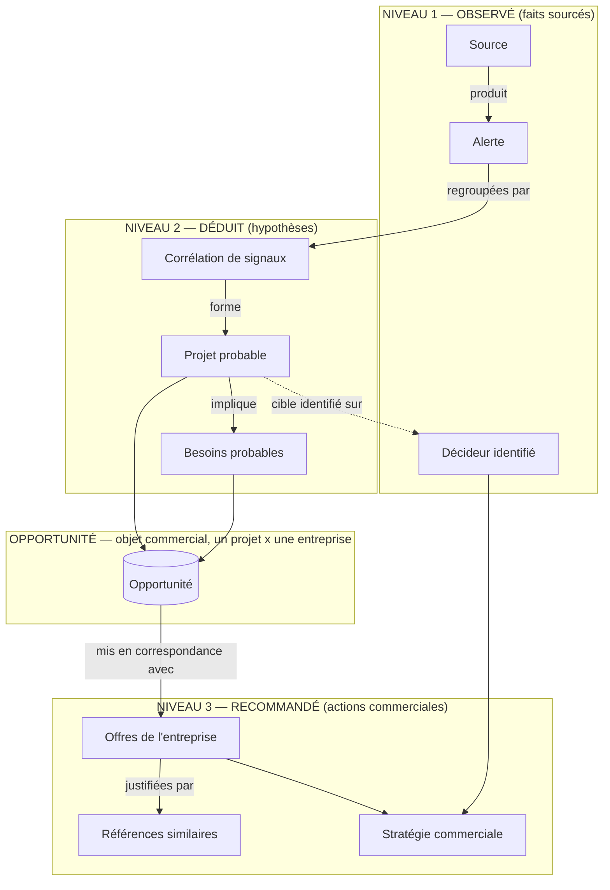

# WINOVYA — Assistant IA de Développement Commercial
## Document de conception produit / UX / architecture

Statut : document de conception uniquement. Aucun code, aucune migration,
aucune branche, aucun commit ne sont produits par ce document.

Principe directeur, valable pour l'ensemble du document : le moteur
raisonne toujours à trois niveaux distincts, jamais mélangés à l'écran ni
dans les données.

| Niveau | Nature | Question à laquelle il répond | Exemple |
|---|---|---|---|
| 1. OBSERVÉ | Fait brut, vérifiable, sourcé | Que s'est-il passé, objectivement ? | "Permis de construire déposé le 12/06, réf. PC-092-2026-0341, source BOAMP" |
| 2. DÉDUIT | Hypothèse construite par corrélation | Que pouvons-nous en conclure ? | "Projet probable : extension d'un site industriel à Clamart, phase Autorisation" |
| 3. RECOMMANDÉ | Action commerciale proposée | Que devrait faire l'entreprise ? | "Contacter le DAF avant le 15/08, angle : mise en conformité énergétique" |

Ce triptyque (Observé / Déduit / Recommandé) est le fil conducteur de tout
le document : modèle conceptuel, cycle de vie, fiche opportunité, sections
d'écran, impacts techniques.

---

## 1. Le nouveau modèle conceptuel

### 1.1 Les objets et leurs relations

- **Source** : un émetteur public ou semi-public d'information (BOAMP,
  Géorisques, presse locale, Conseil municipal, INPI, Airtable legacy...).
  Une source produit des **Alertes**. Une source a une fiabilité connue
  (officielle, déclarative, tierce).
- **Alerte** : un fait unitaire observé, daté, sourcé, avec un lien vers le
  document d'origine quand il existe. Une alerte seule n'est **jamais**
  une opportunité. Une alerte appartient à une seule source, mais peut être
  rattachée à plusieurs projets probables (ex. un permis de construire
  peut concerner plusieurs entreprises clientes différentes selon leurs
  compétences).
- **Corrélation** : le mécanisme (aujourd'hui : `CorrelationEngine`, clé
  déterministe) qui regroupe plusieurs alertes en un même **Projet
  probable**. La corrélation elle-même a un niveau de confiance
  (haute/basse) qui doit rester visible, jamais masqué.
- **Projet probable** : l'hypothèse centrale — "il se passe probablement
  quelque chose de précis, à tel endroit, à telle phase". C'est un objet
  DÉDUIT, jamais un fait. Il porte : l'entité cible, la géographie, la
  phase (intention → étude → foncier → autorisation → consultation →
  appel d'offres), le niveau de confiance global.
- **Opportunité** : l'objet commercial qui enveloppe un projet probable
  **pour une entreprise cliente donnée**. La même alerte/le même projet
  probable peut engendrer une opportunité différente selon l'entreprise
  (ses compétences, sa zone de chalandise). L'opportunité est ce que
  l'entreprise cliente consulte, qualifie, assigne, suit dans le temps.
- **Besoin probable** : une déduction de second niveau, dérivée du projet
  probable + de sa phase + de sa catégorie. Un projet de "construction
  d'usine" en phase "autorisation" implique probablement des besoins en
  "bureau d'études structure", "VRD", "mise en conformité ICPE" — jamais
  inventés au hasard, toujours reliés à une règle explicite et traçable
  (même logique de transparence que `DossierEnrichmentService`
  aujourd'hui : une raison = une règle documentée).
- **Offre de l'entreprise** : ce que l'entreprise cliente sait vendre
  (aujourd'hui capturé de façon informelle dans `competences`,
  `secteurs_intervention`, `mots_cles_metiers`). Doit devenir un objet de
  premier ordre, structuré, pour pouvoir être mis en correspondance avec
  un besoin probable.
- **Référence** : une preuve que l'entreprise a déjà réalisé une mission
  comparable (aujourd'hui `references_clients`, texte libre). Sert à
  justifier une recommandation d'offre, jamais à la remplacer.
- **Décideur** : une personne physique identifiée côté donneur d'ordre,
  avec son rôle d'achat. Un décideur est rattaché au projet probable (pas
  directement à l'opportunité) — plusieurs opportunités de plusieurs
  entreprises différentes peuvent cibler le même décideur sur le même
  projet.
- **Stratégie commerciale** : la synthèse RECOMMANDÉE finale — quand
  agir, qui contacter, avec quel angle, quelles offres mettre en avant,
  quelles références citer. C'est un objet dérivé, recalculé, jamais
  saisi manuellement en texte libre par un humain (sinon on perd la
  traçabilité "pourquoi le pensons-nous").

### 1.2 Diagramme (relations)



**Lecture du diagramme** : une Source alimente des Alertes (niveau
Observé, jamais modifié). La Corrélation transforme un ensemble d'Alertes
en Projet probable, qui implique des Besoins probables (niveau Déduit,
toujours révisable, toujours expliqué). L'Opportunité est le contenant
commercial qui associe un Projet probable à une entreprise cliente. À
partir de là, le moteur recommande des Offres justifiées par des
Références, et une Stratégie commerciale qui mobilise aussi les Décideurs
identifiés (niveau Recommandé, toujours actionnable, jamais figé).

---

## 2. Le nouveau cycle de vie d'une opportunité

```
Alerte
  → Corrélation (regroupement de signaux faibles, clé déterministe + confiance)
    → Projet probable (entité, géographie, phase, confiance globale)
      → Qualification IA (l'opportunité est créée POUR une entreprise donnée :
                            croisement projet probable × zone de chalandise ×
                            secteurs suivis de cette entreprise)
        → Besoins probables (dérivés de la catégorie + phase du projet,
                              règles explicites et traçables)
          → Offres recommandées (mise en correspondance besoins ↔ compétences
                                  de l'entreprise, classées par pertinence)
            → Décideurs (rattachés au projet, rôle d'achat, statut de fraîcheur)
              → Plan d'action commercial (quand, qui, pourquoi, angle, étapes)
```

Points de vigilance sur ce cycle :

- Chaque flèche est un point où de l'incertitude peut être introduite —
  chaque étape doit donc conserver son propre niveau de confiance, jamais
  agrégé en un score unique opaque (cohérent avec la contrainte déjà en
  place aujourd'hui : "jamais de score inventé").
- Le cycle n'est pas strictement séquentiel dans le temps : une nouvelle
  alerte peut arriver après qu'un Plan d'action a déjà été proposé. Dans
  ce cas, seules les étapes en aval de la nouvelle information sont
  recalculées (ex. une alerte confirmant un budget ne doit pas
  réinitialiser les Décideurs déjà identifiés).
- La "Qualification IA" est l'étape qui n'existe pas clairement
  aujourd'hui : c'est elle qui décide si un projet probable devient une
  opportunité pertinente pour telle entreprise, et pas seulement "toutes
  les alertes de la zone suivie".

---

## 3. La nouvelle fiche Opportunité

Conçue de zéro, organisée strictement autour des quatre questions
demandées. Chaque section ci-dessous suit le même canevas : objectif
métier, contenu, composants UI, données nécessaires, données déjà
disponibles, données à créer.

### 3.1 Section "Que pensons-nous ?" (le Projet probable)

- **Objectif métier** : donner en 5 secondes une compréhension du projet
  probable, sans avoir à lire une seule alerte.
- **Contenu** : titre reformulé du projet (pas le titre brut de l'alerte
  la plus récente), entité cible, géographie, phase actuelle du projet,
  niveau de confiance global, date du dernier signal.
- **Composants UI** : bandeau d'en-tête avec badge de phase (frise
  horizontale intention → ... → appel d'offres, position actuelle
  surlignée), badge de confiance à trois couleurs (élevé/moyen/faible,
  jamais un pourcentage arbitraire), compteur "X signaux depuis le
  JJ/MM".
- **Données nécessaires** : entité cible, géographie, phase, confiance,
  dates premier/dernier signal, nombre de signaux.
- **Déjà disponibles** : `opportunites.entite_cible`, `geographie`,
  `phase_projet`, `niveau_confiance`, `date_premier_signal`,
  `date_dernier_signal`, `nombre_signaux` (tout existe déjà, Sprint
  1-4).
- **À créer** : une phrase de synthèse reformulée par le moteur ("ce que
  nous pensons"), aujourd'hui `resume` existe mais est un gabarit très
  factuel ; il faudrait un champ distinct, plus lisible, du type
  `synthese_projet` — toujours généré par règle déterministe, jamais par
  génération libre non tracée.

### 3.2 Section "Pourquoi le pensons-nous ?" (la preuve = Alertes liées)

Voir section 5 dédiée ci-dessous — cette question EST la nouvelle section
"Alertes liées", qui absorbe Chronologie et Preuves (voir section 4).

- **Objectif métier** : permettre à un commercial de vérifier lui-même
  chaque affirmation avant d'appeler un client, sans jamais avoir à faire
  confiance aveuglément au moteur.
- **Contenu** : liste chronologique complète des alertes ayant contribué à
  ce projet probable, avec pour chacune la preuve documentaire quand elle
  existe.
- **Déjà disponibles** : `opportunite_alertes`, `alertes.*`,
  `opportunite_preuves.*` (existent déjà, à fusionner en une seule vue).
- **À créer** : un champ explicite "rôle dans la corrélation" par alerte
  (ex. "signal déclencheur", "signal confirmant", "signal contextuel") —
  n'existe pas aujourd'hui, voir section 8.

### 3.3 Section "Que pourrait vendre cette entreprise sur ce projet ?" (Offres recommandées)

Voir section 6 dédiée ci-dessous.

- **Objectif métier** : transformer une hypothèse de projet en argumentaire
  de vente concret, sans jamais citer une compétence brute isolée.
- **Contenu** : liste des offres recommandées, chacune justifiée par le
  besoin probable qu'elle couvre et par une référence similaire si elle
  existe.
- **Déjà disponibles** : `entreprises.competences`,
  `entreprises.references_clients` (texte libre, non structuré).
- **À créer** : table structurée des offres, table de correspondance
  besoin ↔ offre, structuration des références (voir section 8).

### 3.4 Section "Quelle stratégie commerciale recommander ?" (Plan d'action)

Voir section 7 dédiée ci-dessous.

- **Objectif métier** : dire explicitement au commercial quoi faire cette
  semaine, pas seulement "voici un projet intéressant".
- **Contenu** : décideur(s) à contacter en priorité, moment recommandé,
  angle d'approche, prochaines étapes concrètes.
- **Déjà disponibles** : `opportunite_decideurs`, `decideurs.*`,
  `opportunites.assigned_to/assigned_at`, `opportunite_notes`,
  `opportunite_activity_log` (existent déjà).
- **À créer** : moteur de recommandation de timing/angle (voir section
  8), aujourd'hui inexistant.

---

## 4. Suppression des redondances

| Section actuelle | Décision | Justification |
|---|---|---|
| **Chronologie** (`ChronologiePanel`) | Supprimée, absorbée | Elle mélange déjà signaux + preuves + décideurs liés dans une simple liste triée par date — c'est exactement la matière première de la nouvelle "Alertes liées", en moins riche (pas de rôle dans la corrélation, pas de niveau de confiance par ligne). Garder les deux créerait deux vues concurrentes de la même vérité. |
| **Preuves** (`PreuvesPanel`) | Supprimée en tant que section séparée, fusionnée | Une preuve aujourd'hui est rattachée à une opportunité mais n'affiche pas explicitement à quelle alerte elle répond — de fait, l'utilisateur doit déjà croiser mentalement Preuves et Alertes liées. Les fusionner en une seule liste (une alerte + sa preuve rattachée, le cas échéant, dans la même ligne) supprime cette charge mentale et cette duplication d'affichage. |
| **Alertes liées** (`AlertesLieesPanel`) | Conservée et enrichie | Devient LA section de preuve du projet (voir section 5). |
| **Décideurs** (`DecideursPanel`) | Conservée, mais déplacée | Reste une section à part entière mais devient un composant du "Plan d'action" (section 7) plutôt qu'une liste isolée sans lien avec une action recommandée. |
| **"Pourquoi cette opportunité"** (bloc raisons factuelles actuel) | Supprimée en tant que bloc autonome, absorbée | Son contenu (nombre de signaux, budget, décideurs, preuves, confiance) devient la synthèse de la section "Que pensons-nous ?" — le doublon (raisons factuelles vs résumé métier vs KPI d'en-tête) actuel est exactement le problème que la nouvelle fiche corrige. |
| **Résumé métier** (bloc `resumeMetier` actuel) | Conservée, repositionnée | Devient la phrase de synthèse de "Que pensons-nous ?", pas un bloc de texte séparé plus bas dans la page. |
| **Notes** (`NotesPanel`) | Conservée telle quelle | Reste un espace libre humain, ne se substitue à aucune donnée structurée — sa nature (texte libre, non tracé comme un fait ni une recommandation) justifie qu'elle reste séparée des trois niveaux Observé/Déduit/Recommandé. |
| **Journal d'activité** (`ActivityTimeline`) | Conservée telle quelle, déplacée en pied de page | Utile pour l'audit ("qui a changé le statut, quand") mais ne fait partie d'aucune des quatre questions métier — reste accessible mais n'occupe plus une position centrale. |

---

## 5. La nouvelle section "Alertes liées" (chronologie complète)

- **Objectif métier** : répondre entièrement à "Pourquoi le pensons-nous
  ?", sans qu'aucune autre section ne soit nécessaire pour vérifier une
  affirmation du moteur.
- **Contenu par ligne** (liste triée par date, la plus récente en haut) :
  date, type de signal (catégorie de veille), résumé court, niveau de
  confiance individuel de ce signal (pas le niveau global du projet — un
  signal isolé peut être "à confirmer" même dans un projet globalement
  fiable), source (nom + fiabilité), document rattaché s'il existe, lien
  externe, rôle dans la corrélation (déclencheur / confirmant /
  contextuel / doublon écarté).
- **Composants UI** : liste dense en ligne (une ligne = un signal), icône
  de rôle dans la corrélation en début de ligne, badge de confiance en
  fin de ligne, clic sur une ligne → popup complète (voir ci-dessous).
  Filtre rapide par rôle dans la corrélation (ex. "voir seulement les
  signaux confirmants").
- **Popup au clic** : reprend l'intégralité du contenu de l'alerte
  (aujourd'hui dispersé entre `AlerteLieeDto` et `PreuveDto`) : texte
  extrait du document source si disponible, lien source, référence
  officielle, montant si présent, acteur/entité, commune, tous les champs
  aujourd'hui visibles uniquement dans la table `alertes` brute.
- **Données nécessaires** : tout ce qui existe déjà dans `alertes` +
  `opportunite_preuves`, plus le nouveau champ "rôle dans la corrélation"
  (à créer, voir section 8).
- **Déjà disponibles** : la quasi-totalité (Sprint 1 à 10).
- **À créer** : champ de rôle dans la corrélation, unification technique
  des deux sources (alertes liées + preuves) en une seule requête/DTO.

---

## 6. La nouvelle section "Solutions que votre entreprise peut proposer"

Principe non négociable : **on ne présente jamais une compétence brute en
premier**. Le raisonnement part toujours du besoin probable, jamais de la
liste de compétences de l'entreprise.

- **Objectif métier** : dire au commercial exactement quoi proposer, avec
  la preuve que ce n'est pas une supposition en l'air.
- **Contenu**, pour chaque offre recommandée :
  1. Le besoin probable couvert (ex. "Mise en conformité ICPE avant le
     démarrage d'exploitation").
  2. L'offre correspondante de l'entreprise (ex. "Diagnostic +
     accompagnement dossier ICPE").
  3. Une référence similaire si elle existe (ex. "Mission comparable
     réalisée pour [client anonymisé ou nommé selon confidentialité] en
     2025").
  4. Un argument commercial court, généré à partir des deux éléments
     ci-dessus (jamais un argumentaire marketing générique).
  5. **En dernier**, discrètement, la ou les compétences qui justifient
     techniquement pourquoi l'entreprise peut le faire — présentées comme
     une justification, jamais comme le point d'entrée.
- **Composants UI** : cartes empilées, une par offre recommandée, triées
  par pertinence décroissante. Chaque carte : besoin en titre, offre en
  sous-titre, référence en citation, argument en corps de texte,
  compétences justificatives en petit texte discret en bas de carte
  (dépliable, jamais imposé visuellement).
- **Données nécessaires** : besoins probables du projet, catalogue
  structuré des offres de l'entreprise, table de correspondance besoin ↔
  offre, références structurées, compétences.
- **Déjà disponibles** : `entreprises.competences` (texte libre),
  `entreprises.references_clients` (texte libre), `entreprises.
  secteurs_intervention`, `mots_cles_metiers`.
- **À créer** (impact majeur, voir section 8) : table `offres` (catalogue
  structuré par entreprise), table `references` (structurée : client,
  année, description, secteur, preuve/lien si disponible), table de
  correspondance `besoins_probables` ↔ `offres`, moteur de matching
  besoin→offre.

---

## 7. La nouvelle section "Plan d'action"

- **Objectif métier** : transformer une opportunité en tâche commerciale
  concrète et datée, pas en simple fiche de lecture.
- **Contenu** :
  - **Quand agir** : fenêtre de temps recommandée (ex. "avant la fin de
    la phase de consultation, estimée sous 3 semaines"), jamais une date
    arbitraire — toujours dérivée de la phase du projet et de son
    historique de progression.
  - **Qui contacter** : le ou les décideurs les plus pertinents pour ce
    besoin précis (pas toute la liste des décideurs du projet), avec leur
    rôle d'achat et leur statut de fraîcheur ("à jour" / "à revérifier").
  - **Pourquoi** : la justification courte reliant le décideur choisi à
    son rôle d'achat et au besoin identifié.
  - **Angle d'approche** : quel argument ouvrir en premier (dérivé
    directement des offres recommandées de la section 6, jamais un angle
    générique).
  - **Prochaines étapes** : 2 à 3 actions concrètes suggérées (ex.
    "envoyer une prise de contact courte", "préparer un dossier de
    référence sur [tel projet comparable]", "vérifier la date de la
    prochaine commission d'urbanisme").
- **Composants UI** : bloc unique en fin de fiche, structuré en quatre
  lignes explicites (Quand / Qui / Pourquoi / Angle), suivi d'une liste à
  cocher des prochaines étapes (permet de transformer directement le plan
  en tâches suivies dans le journal d'activité existant).
- **Données nécessaires** : phase et historique de progression du projet,
  décideurs qualifiés par rôle d'achat, offres recommandées (section 6).
- **Déjà disponibles** : `phase_projet`, `opportunite_decideurs`,
  `decideurs.role_achat`, `decideurs.statut`, `opportunite_activity_log`
  (pour l'historique de progression).
- **À créer** : moteur de recommandation de fenêtre temporelle (règles à
  définir avec le métier, par phase), moteur de sélection du/des
  décideur(s) prioritaire(s) pour un besoin donné, génération de l'angle
  d'approche à partir de l'offre recommandée n°1.

---

## 8. Impacts techniques (sans coder)

### Nouvelles tables

- `offres` : catalogue structuré des offres par entreprise (id,
  entreprise_id, intitulé, description courte, secteurs concernés, mots-
  clés).
- `references_clients_structurees` : réécriture structurée de
  `entreprises.references_clients` (id, entreprise_id, client, année,
  description, secteur, lien/preuve optionnelle).
- `besoins_probables` : catalogue des besoins déductibles par catégorie de
  veille + phase de projet (référentiel de règles, pas de données
  utilisateur).
- `opportunite_besoins` : liaison N-N entre une opportunité et les
  besoins probables déduits pour elle, avec la règle ayant produit chaque
  besoin (traçabilité).
- `besoin_offre_matching` : table de correspondance besoin ↔ offre (peut
  être un référentiel global ou spécifique par entreprise selon la
  granularité choisie avec le métier).
- `plan_action` : une ligne par opportunité, contenant la fenêtre
  temporelle recommandée, le/les décideur(s) prioritaire(s), l'angle
  d'approche, et la liste des prochaines étapes (avec état coché/non
  coché).

### Tables à modifier

- `opportunite_alertes` : ajout d'un champ "rôle dans la corrélation"
  (déclencheur / confirmant / contextuel / doublon écarté).
- `alertes` : rien de structurel, mais vérifier que tous les champs déjà
  utilisés en popup (texte extrait, référence officielle) sont bien
  exposés par l'API existante.
- `opportunites` : ajout d'un champ `synthese_projet` (phrase de synthèse
  "que pensons-nous", distincte du `resume` actuel plus factuel/gabarit).
- `entreprises` : à terme, dépréciation progressive des champs texte
  libre `competences`/`references_clients` au profit des nouvelles tables
  structurées (migration de données, pas de suppression brutale).

### Nouveaux champs (résumé)

- `opportunite_alertes.role_correlation`
- `opportunites.synthese_projet`
- Champs des nouvelles tables listées ci-dessus.

### Nouvelles API (niveau service, pas d'implémentation)

- Service de gestion du catalogue d'offres (CRUD offres/références par
  entreprise cliente — probablement une nouvelle section d'administration
  pour que chaque entreprise cliente puisse déclarer/mettre à jour ses
  offres, plutôt qu'un texte libre non structuré).
- Service de déduction des besoins probables (règles déterministes par
  catégorie de veille × phase de projet — même esprit que
  `DossierEnrichmentService` actuel).
- Service de matching besoin → offre (règles déterministes, transparentes,
  jamais un score de similarité opaque non explicable).
- Service de génération du plan d'action (règles déterministes par phase
  + rôle d'achat).

### Migrations

- Migrations additives uniquement (nouvelles tables, nouvelles colonnes
  nullables), aucune suppression de colonne existante avant que la
  dépréciation soit validée par le métier.
- Migration de données : transformation progressive des champs texte
  libre (`competences`, `references_clients`) vers les nouvelles tables
  structurées — nécessitera une phase de saisie/validation avec chaque
  entreprise cliente (les données actuelles ne sont pas assez
  structurées pour être migrées automatiquement sans supervision).

### Évolution IA

- Le moteur reste dans la même philosophie que l'existant (règles
  déterministes, explicables, jamais de génération de texte libre non
  tracée) pour les niveaux Observé et Déduit.
- Le niveau Recommandé (angle d'approche, argument commercial) est le
  premier endroit du produit où une génération de texte plus flexible
  (LLM) pourrait apporter de la valeur — mais toujours à partir
  d'éléments structurés déjà déduits (besoin, offre, référence), jamais à
  partir d'une alerte brute directement. Ce point mérite une décision
  produit séparée (voir roadmap, dernier sprint).

---

## 9. Roadmap (sprints de 2 à 3 jours)

Priorisation : d'abord la suppression de redondance et la restructuration
de la fiche (valeur immédiate, faible risque, pas de nouvelle donnée
requise), puis les besoins/offres structurés (valeur commerciale forte,
nécessite de la donnée métier), puis le plan d'action (dépend des deux
précédents).

| Sprint | Contenu | Dépendance |
|---|---|---|
| **11** | Fusion Chronologie + Preuves + "Pourquoi cette opportunité" en une seule section "Alertes liées" enrichie (sans le champ rôle dans la corrélation, qui vient après) | Aucune |
| **12** | Ajout du champ "rôle dans la corrélation" (table + règle de calcul simple + affichage), popup complète par alerte | Sprint 11 |
| **13** | Restructuration de l'en-tête de fiche autour de "Que pensons-nous ?" (synthèse de projet, frise de phase, confiance globale) | Sprint 11 |
| **14** | Conception détaillée (avec le métier) du référentiel de besoins probables par catégorie de veille × phase — spécification uniquement, pas d'implémentation | Aucune, peut démarrer en parallèle |
| **15** | Modélisation + migration additive des tables `offres` et `references_clients_structurees`, sans encore d'écran de saisie | Sprint 14 |
| **16** | Écran d'administration minimal pour qu'une entreprise cliente déclare ses offres et références structurées | Sprint 15 |
| **17** | Implémentation du service de déduction des besoins probables (règles définies au Sprint 14) + table `opportunite_besoins` | Sprint 14, 15 |
| **18** | Implémentation du service de matching besoin → offre + nouvelle section "Solutions que votre entreprise peut proposer" | Sprint 16, 17 |
| **19** | Conception détaillée du plan d'action (règles de fenêtre temporelle par phase, règles de sélection du décideur prioritaire) — spécification | Sprint 17 |
| **20** | Implémentation de la table `plan_action` + section "Plan d'action" (sans génération d'angle par IA générative, règles déterministes uniquement) | Sprint 18, 19 |
| **21** | Décision produit + cadrage sur l'usage d'un LLM pour l'angle d'approche/l'argument commercial (à partir des données structurées uniquement) | Sprint 20 |
| **22** | Nettoyage final : dépréciation des anciens blocs (`resumeMetier` factuel, ancien bloc "raisons"), migration de données legacy vers les nouveaux champs, recette complète | Tous les précédents |

---

*Fin du document de conception. Aucun fichier de code, aucune migration,
aucune branche et aucun commit n'ont été produits.*
